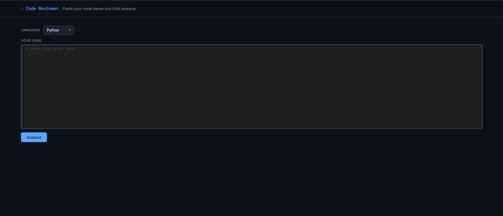
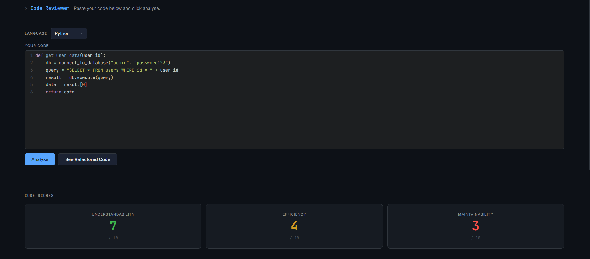
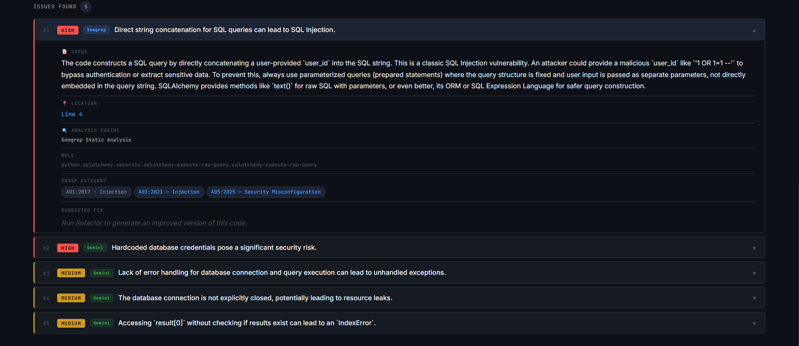
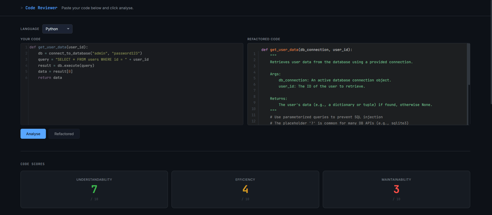
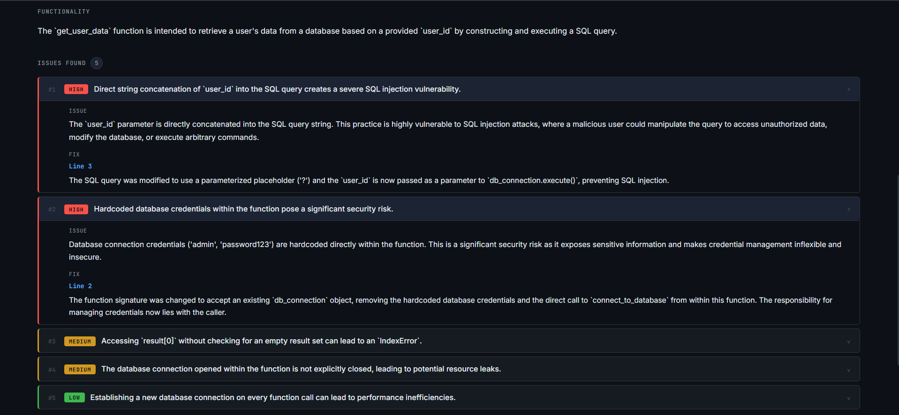

# AI Code Analyser

AI Code Analyser is a full-stack web application that analyses source code using a two-agent AI pipeline powered by Google's Gemini API. The first agent identifies bugs, security vulnerabilities, and code quality issues with severity ratings. The second agent generates a refactored version of the code that addresses every issue found — but only when the user asks for it, encouraging developers to attempt fixes themselves first.

Originally built as a portfolio project, the long-term goal is to develop this into an educational platform that helps programmers improve their skills through iterative, AI-assisted feedback.

---

## Live Demo

https://code-analyser-bk91.onrender.com

> **Note:** The application is hosted on Render's free tier. The first visit after a period of inactivity may take **30-60 seconds** to load while the server wakes up.

---

## Features

- 🔍 **Two-agent AI pipeline** — analysis and refactoring handled by separate specialised agents
- 🚨 **Severity-based issue categorisation** — issues ranked as High, Medium, or Low
- 📋 **Expandable accordion reports** — click any issue to reveal the corresponding fix
- 📊 **Code quality scores** — Understandability, Efficiency, and Maintainability rated out of 10
- ✏️ **Syntax-highlighted code editor** — powered by CodeMirror with Tomorrow Night theme
- 🌐 **Multi-language support** — Python, JavaScript, Java, C++, TypeScript
- 📱 **Responsive design** — scales across screen sizes from laptop to large monitor
- 🎨 **Dark mode UI** — code-editor aesthetic throughout

---

## Screenshots

### Landing Page


### Code Analysis



### Refactored Output



---

## How It Works

1. Paste your code into the editor and select a language
2. Click **Analyse** — Agent 1 reviews the code and returns issues, scores, and a summary
3. Read the issues and try to fix them yourself
4. Click **See Refactored Code** when ready — Agent 2 generates a corrected version using Agent 1's findings as context
5. Expand each issue accordion to see exactly what was fixed and on which line

---

## Tech Stack

### Frontend
- HTML5, CSS3, JavaScript
- [CodeMirror 5](https://codemirror.net/) — code editor with syntax highlighting
- [Prism.js](https://prismjs.com/) — syntax highlighting for refactored output

### Backend
- Python 3.11+
- [Flask](https://flask.palletsprojects.com/) — web framework
- [Flask-CORS](https://flask-cors.readthedocs.io/) — cross-origin request handling
- [python-dotenv](https://pypi.org/project/python-dotenv/) — environment variable management

### AI
- [Google Gemini API](https://ai.google.dev/) — `gemini-2.5-flash` model
- [google-genai](https://pypi.org/project/google-genai/) — official Python SDK

---

## Prerequisites

Before running this project locally, ensure you have:

- Python 3.11 or newer
- Git
- A modern web browser (Chrome, Brave, Firefox, Edge, Opera GX)
- A Google account with a Gemini API key

Generate a free Gemini API key at [aistudio.google.com](https://aistudio.google.com/app/apikey). Google provides a generous free tier suitable for personal projects and development.

---

## Installation

### 1. Clone the repository

```bash
git clone https://github.com/Hars-Raj/Code_analyser.git
cd Code_analyser
```

### 2. Create a virtual environment

**Windows**
```bash
python -m venv venv
venv\Scripts\activate
```

**macOS / Linux**
```bash
python3 -m venv venv
source venv/bin/activate
```

### 3. Install dependencies

```bash
pip install -r backend/requirements.txt
```

### 4. Configure environment variables

Inside the `backend/` folder, create a file named `.env` and add your API key:

```env
GEMINI_API_KEY=your_api_key_here
```

> ⚠️ Never commit your `.env` file. It is already included in `.gitignore`.

### 5. Run the application

```bash
cd backend
python app.py
```

Open your browser and navigate to:

```
http://localhost:5000
or 
http://127.0.0.1:5000/
```

---

## Project Structure

```
Code_Analyser/
│
├── backend/
│   ├── app.py                  # Flask server — API routes
│   ├── reviewer.py             # Two-agent pipeline logic
│   ├── requirements.txt        # Python dependencies
│   └── prompts/
│       ├── __init__.py
│       ├── analyser_prompt.py  # Agent 1 prompt — code analysis
│       └── refactorer_prompt.py # Agent 2 prompt — code refactoring
│
├── frontend/
│   ├── index.html              # App structure
│   ├── style.css               # Dark mode styling and responsive layout
│   └── script.js               # UI logic, API calls, accordion behaviour
│
├── .gitignore
└── README.md
```

---

## API Endpoints

| Method | Endpoint | Description |
|--------|----------|-------------|
| `GET` | `/` | Serves the frontend |
| `POST` | `/analyse` | Runs Agent 1 — returns issues, scores, summary |
| `POST` | `/refactor` | Runs Agent 2 — returns refactored code and change log |

**Request body for `/analyse`:**
```json
{
  "code": "your code here",
  "language": "python"
}
```

**Request body for `/refactor`:**
```json
{
  "code": "your original code here",
  "analysis": { ... }
}
```

---

## Environment Variables

| Variable | Required | Description |
|----------|----------|-------------|
| `GEMINI_API_KEY` | Yes | Your Google Gemini API key from AI Studio |

---

## Known Limitations

- The Gemini free tier has rate limits — heavy usage may result in temporary 429 errors
- Users must supply their own API key for hosted use (bring-your-own-key model)
- Refactored output quality depends on Gemini's response — results may vary between runs
- Large files may hit output token limits on the free tier

---

## Roadmap

Planned improvements for future versions:

- [ ] User authentication and accounts
- [ ] Analysis history and session persistence
- [ ] Progress tracking across multiple attempts (comparison agent)
- [ ] OWASP vulnerability categorisation
- [ ] PDF report export
- [ ] HuggingFace model as an alternative provider
- [ ] Database integration via Supabase
- [ ] Dockerised deployment

---

## Contributing

This project is in active early development. If you find a bug or have a suggestion, feel free to open an issue or submit a pull request.

---

## License

This project is currently unlicensed. All rights reserved by the author.

---

## Author

**Raj Harsh**  
GitHub: [github.com/Hars-Raj](https://github.com/Hars-Raj)

Built as a pre-university portfolio project while interning at an AI startup in Singapore.